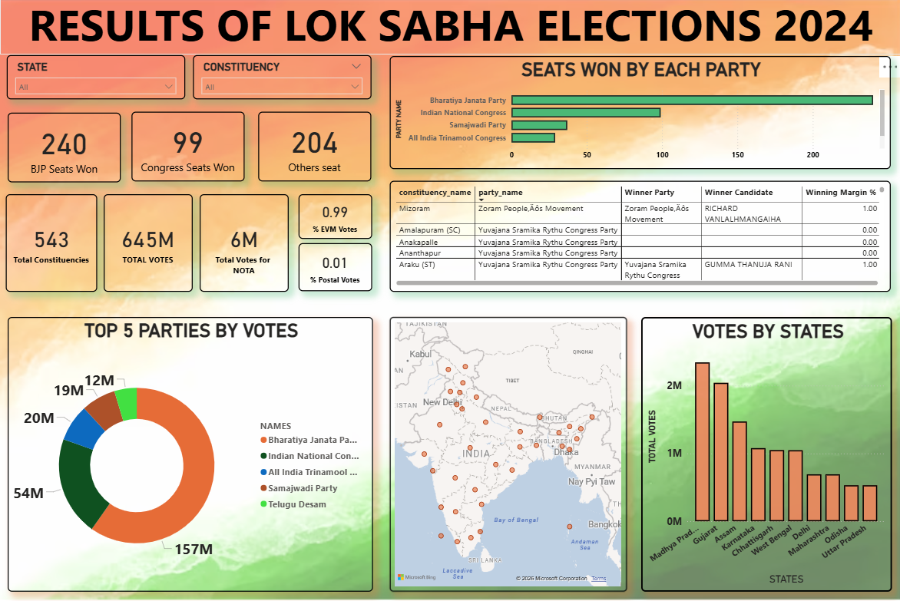
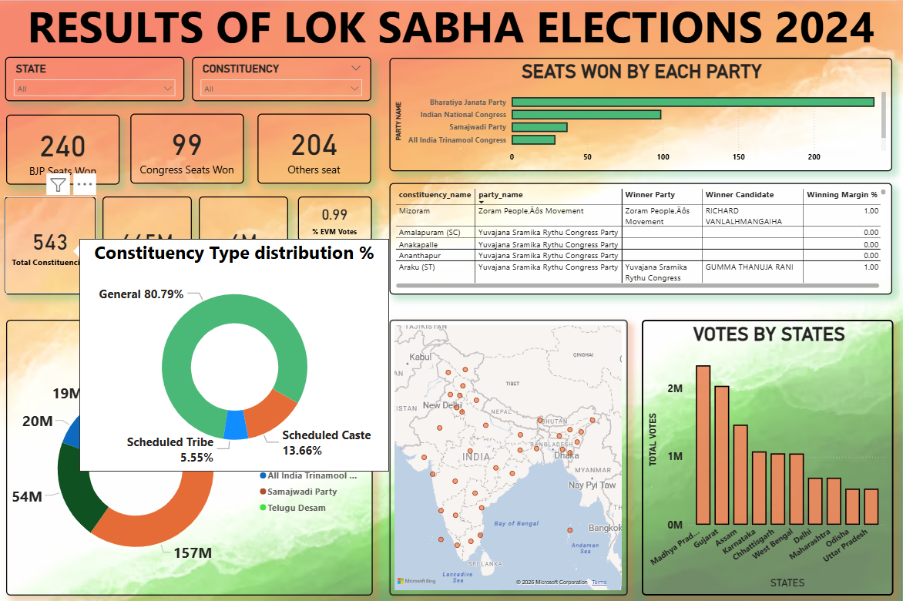
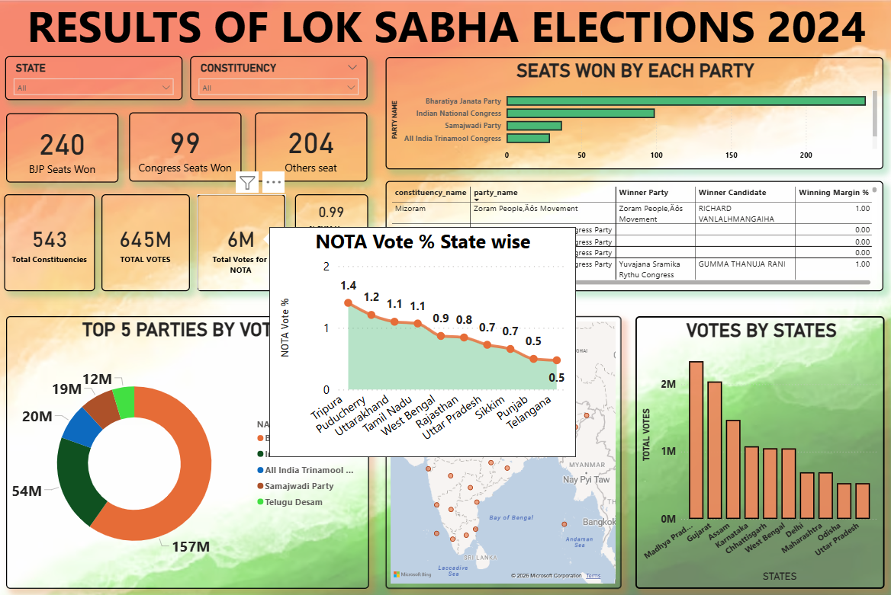

# Lok Sabha Elections 2024 Dashboard

An interactive Power BI dashboard transforming India's 2024 General Election data into meaningful insights through dynamic KPIs, constituency-level analysis, state-wise trends, geospatial visualizations, and custom tooltips.

---

# 📌 About the Project

The **Lok Sabha Elections 2024 Dashboard** is an interactive Business Intelligence project developed using **Microsoft Power BI** to analyze the results of India's 2024 General Elections.

The dashboard transforms raw election data into meaningful insights through interactive visualizations, enabling users to explore party performance, constituency-wise results, vote distribution, state-wise trends, and electoral patterns.

Designed using **Power BI, DAX, and Power Query**, the report combines KPI cards, interactive slicers, maps, custom tooltips, and analytical charts to deliver an engaging and intuitive reporting experience.

---

# 🎯 Objectives

This dashboard helps answer questions such as:

- Which political party secured the highest number of seats?
- How are seats distributed among different political parties?
- Which states recorded the highest number of votes?
- What are the constituency-wise election results?
- How does the NOTA vote percentage vary across states?
- How are constituencies distributed across General, SC, and ST categories?
- How do election insights change when filtered by state or constituency?

---

# ✨ Dashboard Features

### 📊 Executive KPIs

- BJP Seats Won
- Congress Seats Won
- Other Parties Seats
- Total Constituencies
- Total Votes
- NOTA Votes
- EVM Vote Percentage
- Postal Vote Percentage

### 🗳 Party Performance Analysis

- Seats Won by Each Political Party
- Top 5 Political Parties by Vote Share

### 🗺 Geographic Analysis

- Interactive India Map
- State-wise Vote Distribution

### 🏛 Constituency-Level Analysis

- Winning Candidate
- Winning Party
- Winning Margin
- Constituency Details

### 💡 Interactive Custom Tooltips

The dashboard includes dedicated tooltip pages that provide additional insights without leaving the main report.

These include:

- Constituency Type Distribution
- State-wise NOTA Vote Percentage

---

# 📸 Dashboard Preview

## Main Dashboard

---

## Tooltip – Constituency Type Distribution

---

## Tooltip – State-wise NOTA Vote Analysis

---

# 📈 Key Insights

- BJP secured the highest number of parliamentary seats with **240 seats**.
- Congress emerged as the second-largest party with **99 seats**.
- The top five political parties accounted for the majority of votes cast nationwide.
- General constituencies represented over **80%** of all parliamentary constituencies.
- State-wise analysis highlights significant variations in voting patterns and NOTA percentages.
- Interactive filters enable detailed exploration of election results at both state and constituency levels.

---

# 🛠 Tools & Technologies

- Microsoft Power BI
- DAX
- Power Query
- Microsoft Excel

---

# 💼 Skills Demonstrated

- Data Cleaning
- Data Transformation
- Data Modeling
- DAX Measures
- KPI Development
- Interactive Dashboard Design
- Data Visualization
- Geospatial Analysis
- Custom Tooltip Design
- Business Intelligence
- Data Storytelling

---

# 📂 Repository Contents

- Power BI Dashboard (.pbix)
- Election Dataset (.csv)
- Dashboard Images

---

# 🚀 Future Enhancements

- Comparison with previous Lok Sabha Elections
- Alliance-wise performance analysis
- Voter turnout analysis
- Mobile-optimized dashboard

---

# 👩‍💻 About the Author

**Simrat Kaur**

B.Tech Computer Science Engineering (Artificial Intelligence & Machine Learning)

Passionate about Data Analytics, Business Intelligence, Machine Learning, and transforming data into meaningful insights through interactive dashboards.

---

## 🌟 Support

If you found this project useful or interesting, feel free to ⭐ the repository.

Feedback and suggestions are always welcome!
